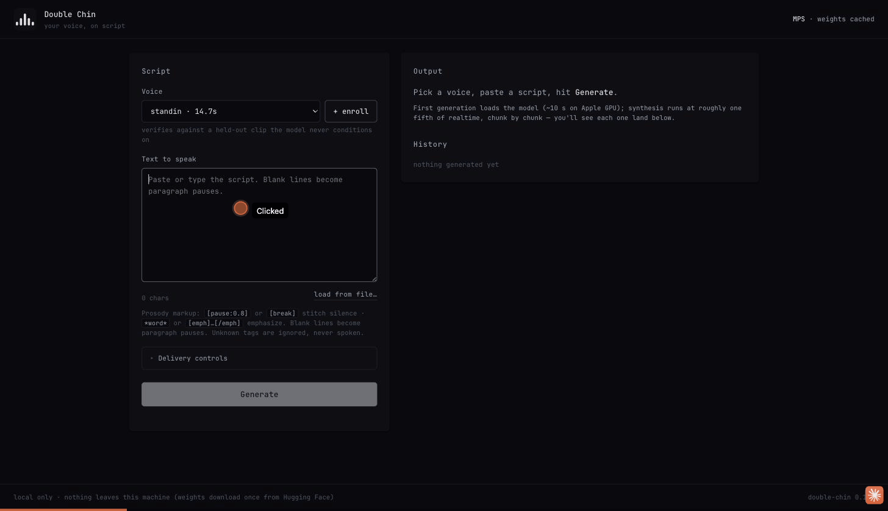

# Double Chin

Your voice, on script.

Double Chin is a local voice-cloning application. Give it a few minutes of someone's voice and a text script, and it reads the script aloud in that voice — entirely on your machine. No cloud, no account, no audio leaving the laptop. One command opens a desktop window built around your own voice: write a script, hit Generate, and watch it synthesize chunk by chunk with a speaker-similarity check on every take.



Watch a real session, script to spoken take:

https://github.com/user-attachments/assets/c634f892-07c8-454f-9c81-ea446cb98faa

## Hear it

Real clips of the owner's voice, cloned by Double Chin from a fine-tuned local model — nothing here is a recording. GitHub doesn't support inline audio players, so each clip below is a static-frame clip carrying the real generated audio track — press play, no download:

https://github.com/user-attachments/assets/f96d3658-2d8f-413d-9aca-d15504a037e2

https://github.com/user-attachments/assets/b0211b0f-7236-49e2-bf2c-ee8a484a1c81

https://github.com/user-attachments/assets/1fdc982a-4d2a-460d-9217-69bc3467c68d

https://github.com/user-attachments/assets/cec0b2f4-6b47-494a-b38a-1b05a76b351e

https://github.com/user-attachments/assets/f9fb50e9-7a2d-4307-8d77-6a95854feded

Each one verifies against a held-out reference clip the model never saw. The underlying voice — the reference audio, the fine-tuned adapter — never leaves this machine and isn't in this repo; only these generated clips are. Raw files: [`demo/owner_finetuned_demo.wav`](demo/owner_finetuned_demo.wav), [`demo/examples/`](demo/examples/). Full method and numbers: [`.goal/ledger.md`](.goal/ledger.md) (gate **PASS 0.822**, near-indistinguishable, threshold 0.70).

## Requirements

- macOS on Apple Silicon (tested: M5 Pro, macOS 26) — Linux/CUDA and CPU also work, slower on CPU
- Python 3.12 (a managed one is fine; `uv` handles it)
- ~6 GB disk for model weights (downloaded once from Hugging Face on first run)

## Setup

```bash
git clone <this-repo> && cd double-chin
uv venv --python 3.12 .venv
uv pip install --python .venv/bin/python -e ".[dev]"
source .venv/bin/activate
double-chin doctor          # checks device, deps, disk — everything should PASS
double-chin app             # opens the desktop window
```

`double-chin app` is the desktop shell. `double-chin studio` serves the same
interface at http://127.0.0.1:8787 in a browser, and `bash packaging/build_app.sh`
builds `dist/Double Chin.app` so it launches from the Dock like any other app.

The window is built around a single voice — the one you enrolled. Delivery
controls, prosody marks and the environment report are there when you want them
and out of the way when you don't; enrolling or switching voices lives in
Settings.

## Clone your own voice

Record the [79-take corpus](recording-scripts/) (~50 minutes), then:

```bash
double-chin enroll yourvoice path/to/recordings/
double-chin train yourvoice path/to/recordings/ --manifest path/to/recordings/manifest.tsv
double-chin say "Hello, world." --voice yourvoice -o out.wav --verify
```

Every enrolled voice lives only in `~/.double-chin/voices/`; deleting that folder revokes it entirely. Don't clone a voice you don't have the right to clone — every output carries an inaudible [Perth watermark](https://github.com/resemble-ai/chatterbox#watermarking), but it's a provenance signal, not a control.

## Licences

Double Chin: MIT. Engine ([Chatterbox TTS](https://github.com/resemble-ai/chatterbox)): MIT. Verifier ([resemblyzer](https://github.com/resemble-ai/Resemblyzer)): Apache 2.0.
