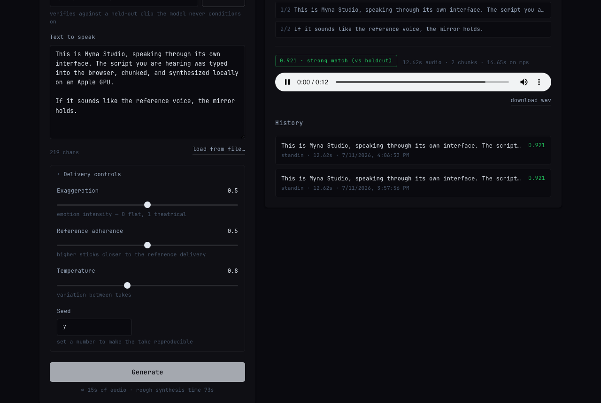

# ChinAI

Your voice, on script.

ChinAI is a local voice-cloning application. Give it a text script and a few seconds of someone's voice, and it reads the script aloud in that voice — entirely on your machine. No cloud, no account, no audio leaving the laptop. One command launches **ChinAI**, the web interface where you enroll voices, type or load a script, watch it synthesize chunk by chunk, and hear the result with a speaker-similarity verdict; the same pipeline is also scriptable from the `chinai` CLI.

**The proof:** a cloned single sentence scored **0.902** and a full 39 s script **0.954** cosine similarity against the reference voice, on a separate speaker-verification model (resemblyzer — different weights, same GE2E family as the engine's conditioning). Negative controls: a *different* real speaker scores 0.672–0.713 on the same metric, so the clone sits far above the wrong-speaker floor. Method, caveats, and full numbers: [docs/design.md §7](docs/design.md). Hear it: [`demo/`](demo/). Try to spot it: [`demo/mirror-test.html`](demo/mirror-test.html).

## Requirements

- macOS on Apple Silicon (tested: M5 Pro, macOS 26) — Linux/CUDA and CPU also work, slower on CPU
- Python 3.12 (a managed one is fine; `uv` handles it)
- ~6 GB disk for model weights (downloaded once from Hugging Face on first run)

## Setup

```bash
git clone <this-repo> && cd ChinAI
uv venv --python 3.12 .venv
uv pip install --python .venv/bin/python -e ".[dev]"
source .venv/bin/activate
chinai doctor          # checks device, deps, disk — everything should PASS
```

## The application

```bash
chinai studio          # starts http://127.0.0.1:8787 and opens your browser
```



Everything happens in one screen: pick an enrolled voice (or enroll one by uploading recordings), paste a script or load a `.txt`, tune delivery (exaggeration / reference adherence / temperature / seed), and Generate. Progress streams live — you watch each chunk land as it's synthesized — then the take auto-plays with its similarity score and verdict, and every generation is kept in a browsable, replayable history under `~/.chinai/studio/`. The server binds to 127.0.0.1 only and a same-origin guard rejects cross-origin and rebound-host requests — Studio has no auth layer, so it refuses anything but the local page (the fix a red team's CSRF/DNS-rebinding finding forced; see [docs/red-team.md](docs/red-team.md)). Watch it run: [`demo/chinai-studio-demo.mp4`](demo/chinai-studio-demo.mp4) — a real session recorded through the interface, ending with the audio that session generated (0.921 vs holdout).

Studio doubles as a local HTTP API (`/api/voices`, `/api/jobs`, SSE progress at `/api/jobs/{id}/events`, `/api/history`, `/api/audio/{id}`) — see [docs/design.md §10](docs/design.md) for the surface and the job model.

## First clone (60 seconds, stand-in voice)

The repo ships a licence-safe stand-in voice so you can watch the pipeline work before recording anything:

```bash
chinai enroll standin demo/assets/arctic_0001.wav demo/assets/arctic_0002.wav \
  demo/assets/arctic_0003.wav demo/assets/arctic_0005.wav \
  demo/assets/arctic_0008.wav demo/assets/ref_a.wav
chinai say "The mirror test is simple: if this sounds like the reference, it works." \
  --voice standin -o first-clone.wav --verify
afplay first-clone.wav
```

First run loads ~6 GB of weights; after that the model loads in under 10 seconds.

## Clone your own voice

Follow the 15-minute [recording kit](docs/recording-scripts.md) — it contains the exact scripts to read and the mic/room rules that make or break a clone. Then:

```bash
chinai enroll me ~/Desktop/my-voice/
chinai say --script your-script.txt --voice me -o out.wav --verify
```

## CLI

| Command | Does |
|---|---|
| `chinai studio` | Launch the ChinAI application (`--port`, `--no-browser`) |
| `chinai enroll NAME SRC...` | Build a voice from recordings (wav/m4a/mp3/flac; files or a folder) |
| `chinai say TEXT \| --script FILE` | Synthesize speech; `--voice NAME` or `--ref WAV`; `-o OUT.wav` |
| `chinai voices` | List enrolled voices |
| `chinai verify A.wav B.wav` | Speaker-similarity score + verdict between any two clips |
| `chinai doctor` | Environment health check (offline) |

Useful `say` flags: `--verify` (score the output against a held-out clip from enrolment, falling back to the reference), `--seed N` (reproducible takes), `--exaggeration 0..1` (emotion intensity), `--cfg 0..1` (reference adherence), `--temperature`, `--device mps|cuda|cpu`.

Know what `--verify` measures: it scores *who* the output sounds like, not *what* was said or whether it is intelligible. A wrong-words render in the right timbre would still score high; listen to your outputs.

## How it works

Zero-shot conditioning, not training: [Chatterbox TTS](https://github.com/resemble-ai/chatterbox) (MIT, 0.5B params) conditions on the first ~10 s of your reference clip and generates speech in that voice. Enrolment just assembles your best reference audio — no GPU-hours, instantly reversible. Scripts are split into sentence-aware chunks, synthesized on Apple's GPU (MPS), stitched with natural pauses, and optionally verified with [resemblyzer](https://github.com/resemble-ai/Resemblyzer) speaker embeddings. Full architecture, tournament, and tradeoffs: [docs/design.md](docs/design.md).

## Project layout

```
src/chinai/        the package: cli, engine, chunk, voices, verify, config
src/chinai/studio/ the application: FastAPI server, jobs, history, static UI
tests/           unit suite (offline, ~2 s) + slow e2e (CHINAI_E2E=1)
docs/            design doc, build log, recording kit, red-team report
demo/            demo scripts, generated audio, videos, UI screenshots
recap.html       the five-minute tour of everything in this repo
```

## Tests

```bash
pytest -m "not slow" -q       # 51 unit tests, offline, ~2 s (engine, CLI, studio API)
CHINAI_E2E=1 pytest -m slow -q  # real script-to-audio run (loads the model)
```

The studio tests inject a fake engine through the app factory, so the whole HTTP surface — enrolment upload, job lifecycle, SSE progress stream, 409 concurrency guard, history, audio serving — runs offline in-process.

## Responsible use

ChinAI is built for cloning **your own voice** on your own machine. Be clear-eyed about what that means: enrolment works from as little as 5 seconds of audio, and while every output carries Resemble's [Perth audio watermark](https://github.com/resemble-ai/chatterbox#watermarking) via the engine, that watermark is an invisible provenance signal — it can be weakened by re-encoding and ChinAI ships no detector for it. It is not a control, just a marker. Don't clone a voice you don't have the right to clone. Every enrolled voice can carry a [voice passport](demo/voice-passport-standin.html) — a provenance card stating what it was built from, how it verifies, and that deleting its folder revokes it entirely (`demo/make_voice_passport.py`). Your recordings and voices never leave the machine (the only network use is the one-time model download from Hugging Face); the adversarial review of every claim in this project is in [docs/red-team.md](docs/red-team.md).

## Licences

ChinAI's own code: MIT. Engine (Chatterbox code + weights): MIT. Verifier (resemblyzer): Apache 2.0. Stand-in audio (CMU Arctic): free CMU licence. Recording-kit texts: public domain. Inventory: [docs/design.md §9](docs/design.md).
