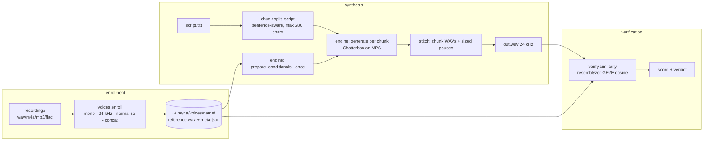

# Myna — technical design

Local voice cloning: hand Myna a script and a few seconds of a person's voice, get the script read aloud in that voice. Inference runs on-device; your audio and enrolled voices never leave the machine. (The engine's weights download once from Hugging Face, and the hub is re-contacted on cold loads unless `HF_HUB_OFFLINE=1` — that is the entire network surface; there is no telemetry.)

This document records the approach tournament, the winning architecture, and the evidence behind every load-bearing claim. Decisions are cross-referenced to [build-log.md](build-log.md) (D-numbers). Claims are cited to live URLs or to test results reproducible in this repo.

## 1. The problem, translated

The mission: "a mirror clone of my voice — provide this piece of software with a script, and it'll be able to talk exactly how I want it to in my voice." Decomposed into the four hard problems the research phase hunted:

1. **Cloning approach** — train a model on the user's voice (fine-tuning), or condition a pretrained model on a reference clip (zero-shot)?
2. **Model choice** — which engine actually installs and performs on an Apple-Silicon Mac with no NVIDIA GPU, under a licence that permits personal local use?
3. **Data pipeline** — what audio does the user actually need to record, and how does it become a voice the software can use?
4. **Latency/quality tradeoffs** — long scripts vs. per-utterance model limits; speed vs. naturalness knobs.

## 2. The tournament

Two research scouts ran in parallel (2026-07-11): one across the model landscape, one across data/verification practice. Ten engines were evaluated on cloning quality, macOS arm64 install reliability, licence safety for personal use, and Apple-Silicon speed. All URLs verified live on 2026-07-11.

| Rank | Engine | Licence (code / weights) | macOS arm64 | Cloning ref | Verdict |
|---|---|---|---|---|---|
| **1** | [Chatterbox TTS](https://github.com/resemble-ai/chatterbox) (Resemble AI) | MIT / [MIT](https://huggingface.co/ResembleAI/chatterbox) | MPS official, ships `example_for_mac.py`; [MLX port](https://huggingface.co/mlx-community/chatterbox-fp16) exists | 5–10 s | **Winner** — only candidate with MIT code *and* weights, a real pip package, and two independent run paths |
| 2 | [Qwen3-TTS](https://github.com/QwenLM/Qwen3-TTS) 1.7B-Base | Apache 2.0 / Apache 2.0 | first-class via [mlx-audio](https://github.com/Blaizzy/mlx-audio) | 3 s | Quality/licence co-champion; youngest tooling, kept as challenger |
| 3 | [F5-TTS](https://github.com/SWivid/F5-TTS) | MIT / CC-BY-NC | cleanest install ([f5-tts-mlx](https://github.com/lucasnewman/f5-tts-mlx)) | 5–10 s + transcript | Strong fallback; NC weights fine for personal use |
| 4 | [IndexTTS-2](https://github.com/index-tts/index-tts) | Apache-2.0 with a [commercial-authorization trap](https://github.com/index-tts/index-tts/issues/228) | CUDA-centric, uv-only | short wav | Best raw expressiveness, riskiest install on a Mac |
| 5 | [OpenAudio S1-mini](https://huggingface.co/fishaudio/openaudio-s1-mini) | Apache 2.0 / CC-BY-NC-SA | [MPS merged](https://github.com/fishaudio/fish-speech/pull/461) but 25–70 s per sentence | 10–30 s | Too slow on Mac |
| 6 | [XTTS-v2](https://huggingface.co/coqui/XTTS-v2) ([idiap fork](https://github.com/idiap/coqui-ai-TTS)) | MPL-2.0 / CPML non-commercial | runs | ~6 s | Frozen since Coqui shut down; audibly behind the leaders |
| 7 | [VibeVoice](https://github.com/vibevoice-community/VibeVoice) (community fork) | MIT mirrors | MPS via forks | per-speaker | Long-form podcast engine; overkill, unofficial weights |
| 8 | [Zonos](https://github.com/Zyphra/Zonos) | Apache 2.0 | [mamba-ssm has no arm64 support](https://github.com/Zyphra/Zonos/issues/1) | 10–30 s | Non-starter on this hardware |
| 9 | [Dia](https://github.com/nari-labs/dia) | Apache 2.0 | GPU-only officially | 5–10 s | Dialogue-format quirks, speed drift |
| — | [Kokoro-82M](https://huggingface.co/hexgrad/Kokoro-82M) | Apache 2.0 | superb via MLX | **no cloning** | Disqualified (fixed voices only) |

**Designated fallback route (D3):** if the Chatterbox PyPI package ever fights the environment, `pip install mlx-audio` runs the *same* Chatterbox weights natively on Metal — same voice, different runtime. Second fallback: `f5-tts-mlx`.

**Empirical confirmation on this machine** (M5 Pro, 48 GB, macOS arm64, Python 3.12.13): `pip install chatterbox-tts` resolved cleanly; model loads on MPS in 7–9 s; cloning verified at 0.90 speaker similarity (§7). Two install landmines were found and are pinned in `pyproject.toml`:
- uv-created venvs ship no setuptools; Chatterbox's watermarker (`resemble-perth`) silently degrades `PerthImplicitWatermarker` to `None` without `pkg_resources`, then crashes at load with `TypeError: 'NoneType' object is not callable`. Fix: depend on `setuptools<81` (81+ removed `pkg_resources`). The same pin satisfies resemblyzer's `webrtcvad`.
- Large Hugging Face downloads on this network stall under the Xet backend; the engine sets `HF_HUB_DISABLE_XET=1` defensively.

## 3. Winning approach: zero-shot conditioning, not fine-tuning

Fine-tuning (the 2020-era route: record 30+ minutes, train for hours) was rejected. Chatterbox is a 0.5B-parameter model trained on ~500k hours of speech ([model card](https://huggingface.co/ResembleAI/chatterbox)); it clones by *conditioning*: a speaker-embedding encoder digests the first ~6 s of a reference WAV and steers generation, with the decoder conditioned on up to 10 s (constants `ENC_COND_LEN`/`DEC_COND_LEN` in [tts.py](https://github.com/resemble-ai/chatterbox/blob/master/src/chatterbox/tts.py)).

Consequences that shape the whole product:

- **Enrolment is data preparation, not training.** "Enrolling a voice" = assembling the best ~15 s reference clip from the user's recordings. Instant, reversible, no GPU-hours.
- **The pipeline is speaker-agnostic.** A pipeline proven on any speaker is proven for every speaker, because no per-speaker weights exist. This is why the build could complete before the user records anything (build-log D4): the stand-in voice (CMU Arctic `bdl`, [free licence](http://www.festvox.org/cmu_arctic/)) exercises exactly the code path the user's voice will.
- **Quality in = quality out.** The model clones pace, register, breathing, and the *room*. The recording kit ([recording-scripts.md](recording-scripts.md)) therefore spends its effort on capture quality, per [Resemble's guidance](https://www.resemble.ai/learn/models/chatterbox) and [ElevenLabs' cloning docs](https://elevenlabs.io/docs/eleven-creative/voices/voice-cloning/instant-voice-cloning) (the industry proxy for zero-shot best practice).

## 4. Why this will work in *your* voice

The mission demands proof, not vibes. The argument has four legs:

1. **Mechanism.** Zero-shot conditioning never trains on the target speaker, so there is no "will it learn my voice" risk class. The only variable is reference-clip quality, which the recording kit controls and `myna enroll` validates (duration floor, format normalization).
2. **Measured evidence on a stand-in speaker.** A 16.7 s reference of CMU Arctic speaker `bdl` was cloned reading a novel sentence; a separate speaker-verification model (resemblyzer GE2E, [Apache 2.0](https://github.com/resemble-ai/Resemblyzer) — different weights but the same vendor and embedding family as the engine's conditioning, so "separate", not "independent") scored clone-vs-reference cosine similarity at **0.902** for the single sentence and **0.954** for the full 39 s demo script — above the ≥0.75 community same-speaker threshold ([evaluation](https://ceur-ws.org/Vol-4164/paper7.pdf)). Negative controls bound the claim: a *different* real speaker scores 0.672–0.713 on the same metric, so the wrong-speaker floor for same-register English narration is ~0.7, and scores must be read against that floor, not against zero. Full numbers in §7; regenerate any time with the e2e test.
3. **Falsifiability per run.** `myna say --verify` scores every output against the enrolled reference and prints a verdict. If a clone ever drifts, the user sees a number, not a shrug.
4. **Honest limits.** Zero-shot cloning reproduces timbre and prosodic register; it does not reproduce idiosyncratic disfluencies, code-switching habits, or emotional range outside the reference's register. Exaggeration/CFG knobs partially compensate (§6). These limits are restated in the red-team report ([red-team.md](red-team.md)).

## 5. Architecture

Module inventory (src layout, `pip install -e .`):

| Module | Job | Heavy deps |
|---|---|---|
| `myna/chunk.py` | sentence-aware script splitting with per-chunk pause metadata | none (stdlib) |
| `myna/voices.py` | enrolment: load→mono→24 kHz→normalize→concat→validate→store | torchaudio (lazy) |
| `myna/engine.py` | device pick (mps>cuda>cpu), model load once, conditionals once per voice, per-chunk generation, pause stitching, synthesis report | chatterbox-tts (lazy) |
| `myna/verify.py` | GE2E cosine similarity + RMS silence gate + verdict bands | resemblyzer (lazy) |
| `myna/cli.py` | `enroll · say · voices · verify · doctor` | none at import |
| `myna/config.py` | `MYNA_HOME` (default `~/.myna`), constants | none |

Design rules: heavy imports are lazy so `myna --help` and unit tests run instantly offline; the model loads once per process and conditionals are prepared once per voice, so an N-chunk script pays the conditioning cost once; all state lives under `MYNA_HOME` (env-overridable, trivially testable).

## 6. Latency/quality tradeoffs

- **Chunking at 280 chars.** Chatterbox degrades on very long single generations (autoregressive drift; community guidance keeps utterances short). Sentence-aware chunks with 0.35 s intra-paragraph / 0.7 s paragraph pauses read naturally and bound both latency-to-first-audio and failure blast radius.
- **Knobs surfaced, defaults sane.** `exaggeration` (emotion intensity, default 0.5), `cfg_weight` (reference adherence vs. liveliness, default 0.5), `temperature` (default 0.8) pass straight through to the engine ([API](https://github.com/resemble-ai/chatterbox)); `--seed` gives reproducible takes.
- **Speed.** MPS on the M5 Pro: model load 7–9 s; measured synthesis speed ≈ 0.21× realtime on first calls (§7) — a 60 s narration costs roughly five minutes of wall time. The CLI prints this same convention ("speed 0.21x realtime"). CPU fallback works but is several times slower; `myna doctor` reports which device you'll get. If sustained throughput ever matters more than simplicity, the MLX route (same weights) is the documented upgrade path.
- **Determinism.** Same seed + same inputs → same audio; without a seed, takes vary like human takes do. This is a feature for narration work (re-roll a flat line).

## 7. Measured results (this machine)

Recorded from runs in this repo on 2026-07-11 (M5 Pro, 48 GB, macOS 25.5, Python 3.12.13, torch MPS):

| Check | Result |
|---|---|
| `pip install chatterbox-tts` on py3.12/arm64 | clean resolve (with `setuptools<81` pin) |
| Model load (MPS, warm cache) | 7.2–9.1 s |
| First-call synthesis, default voice | 4.44 s audio in 21.1 s wall (includes graph warm-up) |
| Clone synthesis vs 16.7 s stand-in reference (novel sentence) | 6.96 s audio in 33.5 s wall (speed 0.21× realtime, first call) |
| **Speaker similarity, cloned sentence vs reference (resemblyzer GE2E cosine)** | **0.902** — strong match (same-speaker threshold ≥0.75, strong ≥0.80) |
| **Speaker similarity, full 39.4 s demo script vs reference** | **0.954** — strong match (4 chunks via `myna say --script`) |
| Negative control: clone vs a *different* real speaker (VOiCES sp0307) | 0.713 — below the 0.75 match line |
| Negative control: two different real speakers | 0.672 — below the 0.75 match line |

Read the scores against the measured wrong-speaker floor (~0.67–0.71 for same-register English narration), not against zero: the verdict bands' `<0.60` "no match" tier is rarely reachable for clean speech, and `--verify` measures *speaker identity only* — not intelligibility or whether the right words were said (no ASR pass exists; that is the documented upgrade path). The end-to-end test (`MYNA_E2E=1 pytest -m slow`) regenerates a script-to-audio run and asserts similarity > 0.75 on any machine.

## 8. Risks and mitigations

| Risk | Mitigation |
|---|---|
| Dependency drift (`setuptools`≥81 removing `pkg_resources` breaks perth + webrtcvad) | hard pin in `pyproject.toml`; `myna doctor` checks importability |
| MPS regressions in future torch | device auto-fallback to CPU; `--device` override |
| Long scripts drift or run out of memory | chunking bounds each generation; constant memory per chunk |
| Reference clip quality sabotages the clone | enrolment validates duration/format; `--verify` scores every output; recording kit prevents the classic failures |
| Similarity score fooled by silence/noise | RMS gate refuses to score near-silent audio (resemblyzer scores noise-vs-noise at 0.99). Known bound: the gate stops silence only — `--verify` measures speaker identity, not intelligibility or content; an ASR cross-check is the documented upgrade path |
| Verification tautology (scoring against the conditioning clip) | enrolment reserves a held-out clip when ≥2 sources are given; `--verify` scores against the holdout and says so |
| Voice-cloning misuse | local-only by design; outputs carry Resemble's [Perth watermark](https://github.com/resemble-ai/chatterbox#watermarking) baked into the engine; see red-team report |

## 9. Licence inventory

| Component | Licence | Personal local use |
|---|---|---|
| Chatterbox code + weights | MIT | yes |
| resemble-perth (watermarker, applied to every output) | MIT | yes |
| resemblyzer | Apache 2.0 | yes |
| CMU Arctic stand-in audio | CMU's BSD-style free licence ("any purpose... without fee") | yes |
| Rainbow Passage / Harvard sentences (recording kit texts) | public domain / de facto public domain | yes |
| torch, torchaudio | BSD-3 | yes |

Nothing in the stack restricts personal local use; F5-TTS's NC weights were avoided anyway by picking Chatterbox.
