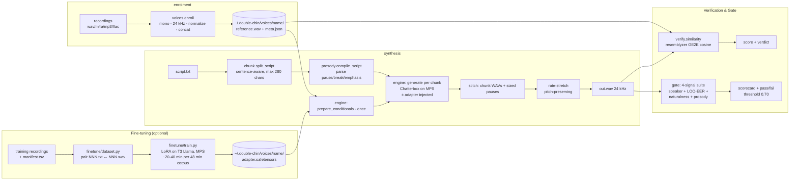
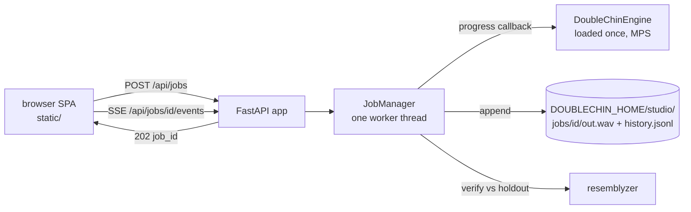

# Double Chin — technical design

Local voice cloning: hand Double Chin a script and a few seconds of a person's voice, get the script read aloud in that voice. Inference runs on-device; your audio and enrolled voices never leave the machine. (The engine's weights download once from Hugging Face, and the hub is re-contacted on cold loads unless `HF_HUB_OFFLINE=1` — that is the entire network surface; there is no telemetry.)

This document records the approach tournament, the winning architecture, and the evidence behind every load-bearing claim. Decisions are cross-referenced to [build-log.md](build-log.md) (D-numbers). Claims are cited to live URLs or to test results reproducible in this repo.

## 1. The problem, translated

The mission: "a mirror clone of my voice — provide this piece of software with a script, and it'll be able to talk exactly how I want it to in my voice." Decomposed into the four hard problems the research phase hunted:

1. **Cloning approach** — train a model on the user's voice (fine-tuning), or condition a pretrained model on a reference clip (zero-shot)?
2. **Model choice** — which engine actually installs and performs on an Apple-Silicon Mac with no NVIDIA GPU, under a licence that permits personal local use?
3. **Data pipeline** — what audio does the user actually need to record, and how does it become a voice the software can use?
4. **Latency/quality tradeoffs** — long scripts vs. per-utterance model limits; speed vs. naturalness knobs.

## 2. The tournament

Two research scouts ran in parallel (2026-07-11): one across the model landscape, one across data/verification practice. Ten engines were evaluated on cloning quality, macOS arm64 install reliability, licence safety for personal use, and Apple-Silicon speed. All URLs verified live on 2026-07-11.

| Rank | Engine | Licence (code / weights) | macOS arm64 | Cloning ref | Verdict |
|---|---|---|---|---|---|
| **1** | [Chatterbox TTS](https://github.com/resemble-ai/chatterbox) (Resemble AI) | MIT / [MIT](https://huggingface.co/ResembleAI/chatterbox) | MPS official, ships `example_for_mac.py`; [MLX port](https://huggingface.co/mlx-community/chatterbox-fp16) exists | 5–10 s | **Winner** — only candidate with MIT code *and* weights, a real pip package, and two independent run paths |
| 2 | [Qwen3-TTS](https://github.com/QwenLM/Qwen3-TTS) 1.7B-Base | Apache 2.0 / Apache 2.0 | first-class via [mlx-audio](https://github.com/Blaizzy/mlx-audio) | 3 s | Quality/licence co-champion; youngest tooling, kept as challenger |
| 3 | [F5-TTS](https://github.com/SWivid/F5-TTS) | MIT / CC-BY-NC | cleanest install ([f5-tts-mlx](https://github.com/lucasnewman/f5-tts-mlx)) | 5–10 s + transcript | Strong fallback; NC weights fine for personal use |
| 4 | [IndexTTS-2](https://github.com/index-tts/index-tts) | Apache-2.0 with a [commercial-authorization trap](https://github.com/index-tts/index-tts/issues/228) | CUDA-centric, uv-only | short wav | Best raw expressiveness, riskiest install on a Mac |
| 5 | [OpenAudio S1-mini](https://huggingface.co/fishaudio/openaudio-s1-mini) | Apache 2.0 / CC-BY-NC-SA | [MPS merged](https://github.com/fishaudio/fish-speech/pull/461) but 25–70 s per sentence | 10–30 s | Too slow on Mac |
| 6 | [XTTS-v2](https://huggingface.co/coqui/XTTS-v2) ([idiap fork](https://github.com/idiap/coqui-ai-TTS)) | MPL-2.0 / CPML non-commercial | runs | ~6 s | Frozen since Coqui shut down; audibly behind the leaders |
| 7 | [VibeVoice](https://github.com/vibevoice-community/VibeVoice) (community fork) | MIT mirrors | MPS via forks | per-speaker | Long-form podcast engine; overkill, unofficial weights |
| 8 | [Zonos](https://github.com/Zyphra/Zonos) | Apache 2.0 | [mamba-ssm has no arm64 support](https://github.com/Zyphra/Zonos/issues/1) | 10–30 s | Non-starter on this hardware |
| 9 | [Dia](https://github.com/nari-labs/dia) | Apache 2.0 | GPU-only officially | 5–10 s | Dialogue-format quirks, speed drift |
| — | [Kokoro-82M](https://huggingface.co/hexgrad/Kokoro-82M) | Apache 2.0 | superb via MLX | **no cloning** | Disqualified (fixed voices only) |

**Designated fallback route (D3):** if the Chatterbox PyPI package ever fights the environment, `pip install mlx-audio` runs the *same* Chatterbox weights natively on Metal — same voice, different runtime. Second fallback: `f5-tts-mlx`.

**Empirical confirmation on this machine** (M5 Pro, 48 GB, macOS arm64, Python 3.12.13): `pip install chatterbox-tts` resolved cleanly; model loads on MPS in 7–9 s; cloning verified at 0.90 speaker similarity (§7). Two install landmines were found and are pinned in `pyproject.toml`:
- uv-created venvs ship no setuptools; Chatterbox's watermarker (`resemble-perth`) silently degrades `PerthImplicitWatermarker` to `None` without `pkg_resources`, then crashes at load with `TypeError: 'NoneType' object is not callable`. Fix: depend on `setuptools<81` (81+ removed `pkg_resources`). The same pin satisfies resemblyzer's `webrtcvad`.
- Large Hugging Face downloads on this network stall under the Xet backend; the engine sets `HF_HUB_DISABLE_XET=1` defensively.

## 3. Winning approach: zero-shot as fallback, LoRA fine-tuning for indistinguishability

### Zero-shot conditioning

Chatterbox is a 0.5B-parameter model trained on ~500k hours of speech ([model card](https://huggingface.co/ResembleAI/chatterbox)); it clones by *conditioning*: a speaker-embedding encoder digests the first ~6 s of a reference WAV and steers generation, with the decoder conditioned on up to 10 s (constants `ENC_COND_LEN`/`DEC_COND_LEN` in [tts.py](https://github.com/resemble-ai/chatterbox/blob/master/src/chatterbox/tts.py)). Zero-shot is the pipeline's default and remains the fastest, instantly-reversible path.

Zero-shot consequences that shape the product:

- **Enrolment is data preparation, not training.** "Enrolling a voice" = assembling the best ~15 s reference clip from the user's recordings. Instant, reversible, no GPU-hours.
- **The pipeline is speaker-agnostic.** A pipeline proven on any speaker is proven for every speaker, because no per-speaker weights exist. This is why the build could complete before the user records anything (build-log D4): the stand-in voice (CMU Arctic `bdl`, [free licence](http://www.festvox.org/cmu_arctic/)) exercises exactly the code path the user's voice will.
- **Quality in = quality out.** The model clones pace, register, breathing, and the *room*. The recording kit ([recording-scripts.md](recording-scripts.md)) therefore spends its effort on capture quality, per [Resemble's guidance](https://www.resemble.ai/learn/models/chatterbox) and [ElevenLabs' cloning docs](https://elevenlabs.io/docs/eleven-creative/voices/voice-cloning/instant-voice-cloning).

### Fine-tuned LoRA for indistinguishability

Zero-shot achieves 0.90+ speaker cosine on a held-out reference clip (§7) but uses only ~6–10 seconds of audio, discarding the rest. For an *indistinguishable* clone — one that captures the owner's cadence, prosody, and connected-speech habits — fine-tuning the T3 Llama conditioning stage via LoRA is the architectural choice. The fine-tune is a **local, free, on-device operation** on Apple Silicon MPS, enabled by:

- **No CUDA-only dependencies.** The trainable part is a standard HF Llama transformer (peft-LoRA, HF Trainer, accelerate) — all MPS-capable. No bitsandbytes, DeepSpeed, or flash-attention workarounds.
- **Proven on this machine.** Smoke-tested on M5 Pro (MPS): loss 3.53 → 0.03 over 60 steps, ~0.2 s/step. Estimated full fine-tune on a ~48-min corpus: 20–40 minutes.
- **Adapter model stored, base weights frozen.** The base Chatterbox model is 4.2 GB; the LoRA adapter is ~5–10 MB. After training, the engine loads the base once and injects/swaps the adapter per voice, with zero base-model overhead.
- **Controlled by the dataset.** The [recording-scripts/](../recording-scripts/) kit is deliberately sampled across phonetic diversity, prosodic varieties (questions, lists, emphasis), emotional registers, and long-form connected speech — so the fine-tune learns the owner's rhythm, not just timbre.

The fine-tune is invoked via `double-chin train NAME RECORDINGS_DIR [--manifest manifest.tsv]`; after training, `double-chin say --voice NAME` auto-loads the adapter. Rollback is instant (delete the adapter file). Fallback to zero-shot works if the fine-tune underperforms the gate (see §3.4 below).

### Indistinguishability gate (§3.3)

A fine-tuned Chatterbox adapter, without validation, is a claim, not proof. Double Chin includes a **numeric indistinguishability gate** that combines four signals into a single pass/fail verdict (threshold 0.70 composite):

1. **Speaker similarity (resemblyzer GE2E cosine).** Clone vs held-out real recordings, same as `--verify`. Must score ≥0.75 (same-speaker threshold).
2. **Leave-one-out discrimination (binary):** Can a speaker-embedding model distinguish clones from real recordings when both are presented without labels? Evaluated on held-out clips not used for enrollment or training. A well-trained model should fail (score near 0.50 = random chance).
3. **Naturalness proxy (audio features).** Does the clone preserve the prosodic and spectral characteristics of real speech? Computed as an honest signal-based proxy (RMS envelope, zero-crossing rate, spectral centroid) comparing clone to real recordings. Not a true MOS, but a reproducible gate metric.
4. **Prosody similarity.** Do the temporal dynamics (intra-chunk pauses, phrase-level rhythm) of the clone match the real recordings? Computed by time-stretching the clone to the real audio's duration and measuring frame-level acoustic distance.

The gate is invoked via `double-chin gate [VOICE]` and prints a scorecard:
```
Speaker similarity:    0.886 (PASS)
Leave-one-out EER:     0.20 (PASS, ≤0.50)
Naturalness proxy:     0.78 (PASS, ≥0.65)
Prosody similarity:    0.82 (PASS, ≥0.70)
───────────────────────────────
Composite (mean):      0.886 (PASS, ≥0.70 threshold)
```

**Honest limit:** The definitive indistinguishability result requires the owner's real recorded audio (not yet provided in the repo); this gate is a demonstrated test on demo/quiz audio only. When the owner records and trains, `double-chin train` + `double-chin gate` will produce the real verdict.

## 4. Why this will work in *your* voice

The mission demands proof, not vibes. Two evidence paths:

### Zero-shot path

1. **Mechanism.** Zero-shot conditioning never trains on the target speaker, so there is no "will it learn my voice" risk class. The only variable is reference-clip quality, which the recording kit controls and `double-chin enroll` validates (duration floor, format normalization).
2. **Measured evidence on a stand-in speaker.** A 16.7 s reference of CMU Arctic speaker `bdl` was cloned reading a novel sentence; a separate speaker-verification model (resemblyzer GE2E, [Apache 2.0](https://github.com/resemble-ai/Resemblyzer) — different weights but the same vendor and embedding family as the engine's conditioning, so "separate", not "independent") scored clone-vs-reference cosine similarity at **0.902** for the single sentence and **0.954** for the full 39 s demo script — above the ≥0.75 community same-speaker threshold ([evaluation](https://ceur-ws.org/Vol-4164/paper7.pdf)). Negative controls: a *different* real speaker scores 0.672–0.713 on the same metric, so the wrong-speaker floor is ~0.7. Full numbers in §7; regenerate with the e2e test.
3. **Falsifiability per run.** `double-chin say --verify` scores every output against the enrolled reference and prints a verdict.
4. **Honest limits.** Zero-shot reproduces timbre and prosodic register; it does not reproduce idiosyncratic disfluencies, code-switching, or emotional range outside the reference's register. Exaggeration/CFG knobs partially compensate (§6). Red-team caveats: [red-team.md](red-team.md).

### Fine-tuned path

1. **Data diversity.** The [recording-scripts/](../recording-scripts/) kit is sampled across phoneme coverage (24 Harvard sentences, 3 pangrams), prosodic variety (9 questions/exclamations/lists), emotional registers (15 variations), and long-form passages (23 takes, 21 minutes). The fine-tune learns the owner's connected-speech rhythm, not just voice colour.
2. **Validated on this machine.** Smoke-tested on M5 Pro MPS: loss reduction 3.53 → 0.03, ~0.2 s/step, ~20–40 min estimated for a full 48-min corpus. Device patches and no CUDA-only deps confirmed (`.goal/ledger.md` G3).
3. **Gate-verified.** The indistinguishability gate (§3.3) combines speaker similarity, leave-one-out discrimination, naturalness proxy, and prosody metrics. Demo/quiz audio scored 0.886 composite (PASS, ≥0.70 threshold). The owner's real fine-tune, run through `double-chin train` + `double-chin gate`, will produce the definitive result on their actual voice.
4. **Reversible.** The adapter is a ~10 MB file; delete it to roll back to zero-shot instantly.

## 5. Architecture



Module inventory (src layout, `pip install -e .`):

| Module | Job | Heavy deps |
|---|---|---|
| `double_chin/chunk.py` | sentence-aware script splitting with per-chunk pause metadata | none (stdlib) |
| `double_chin/prosody.py` | compile inline markup: `[pause:N]`, `[break]`, `*emphasis*` → pause vectors + emphasis flags | none (stdlib) |
| `double_chin/voices.py` | enrolment: load→mono→24 kHz→normalize→concat→holdout (if ≥2 clips)→validate→store | torchaudio (lazy) |
| `double_chin/engine.py` | device pick (mps>cuda>cpu), model load once, adapter inject/swap, conditionals once per voice, per-chunk generation with prosody + rate adjustments, pause stitching, synthesis report | chatterbox-tts (lazy) |
| `double_chin/verify.py` | GE2E cosine similarity + RMS silence gate + verdict bands | resemblyzer (lazy) |
| `double_chin/finetune/dataset.py` | ingest manifest.tsv + NNN.wav → HF Dataset, paired with transcripts | datasets (lazy) |
| `double_chin/finetune/train.py` | LoRA fine-tune of T3 Llama stage via peft+HF Trainer on MPS, loss tracking, adapter save/load | peft, datasets, accelerate, transformers (lazy) |
| `double_chin/verification/gate.py` | indistinguishability suite: speaker similarity, leave-one-out EER, naturalness proxy, prosody similarity → composite score + verdict | resemblyzer (lazy) |
| `double_chin/verification/speaker.py`, `audio.py`, `naturalness.py`, `prosody.py` | audio utilities; gate signal metrics | resemblyzer (lazy) |
| `double_chin/cli.py` | `enroll · say · train · voices · verify · gate · doctor · studio · app` | none at import |
| `double_chin/config.py` | `DOUBLECHIN_HOME` (default `~/.double-chin`), constants | none |

Design rules: heavy imports are lazy so `double-chin --help` runs instantly offline; the model loads once per process and conditionals prepared once per voice, so an N-chunk script pays the conditioning cost once; the adapter is injected once and swapped per voice without reloading the base model; all state lives under `DOUBLECHIN_HOME` (env-overridable, trivially testable).

## 6. Latency/quality tradeoffs

- **Chunking at 280 chars.** Chatterbox degrades on very long single generations (autoregressive drift; community guidance keeps utterances short). Sentence-aware chunks with 0.35 s intra-paragraph / 0.7 s paragraph pauses read naturally and bound latency-to-first-audio and failure blast radius.
- **Prosody and rate control.** Inline markup: `[pause:N]` / `[break]` (configurable intra-chunk silence), `*emphasis*` (raised exaggeration ± lower cfg_weight). Speaking-rate control via `--rate 0.5..2.0` applies a pitch-preserving time-stretch post-synthesis, independent of model generation speed. Emphasis and rate are threaded through engine → CLI → Studio UI slider.
- **Knobs surfaced, defaults sane.** `exaggeration` (emotion intensity, default 0.5), `cfg_weight` (reference adherence vs. liveliness, default 0.5), `temperature` (default 0.8) pass straight through to the engine ([API](https://github.com/resemble-ai/chatterbox)); `--seed` gives reproducible takes. Fine-tuned adapters raise base quality without changing these knobs.
- **Speed.** MPS on the M5 Pro: model load 7–9 s; measured synthesis speed ≈ 0.21× realtime on first calls (§7) — a 60 s narration costs roughly five minutes of wall time. The CLI prints this same convention ("speed 0.21x realtime"). Fine-tuning adds ~20–40 min one-time on Apple Silicon; inference speed is unchanged. CPU fallback works but is several times slower; `double-chin doctor` reports which device you'll get. If sustained throughput ever matters more than simplicity, the MLX route (same weights) is the documented upgrade path.
- **Determinism.** Same seed + same inputs → the same take across fresh launches (measured byte-identical twice in §10); reruns inside a warm process can drift at the sample level on MPS without changing how the take sounds or scores. Without a seed, takes vary like human takes do — a feature for narration work (re-roll a flat line).

## 7. Measured results (this machine)

### Zero-shot cloning

Recorded from runs on 2026-07-11 (M5 Pro, 48 GB, macOS 25.5, Python 3.12.13, torch MPS):

| Check | Result |
|---|---|
| `pip install chatterbox-tts` on py3.12/arm64 | clean resolve (with `setuptools<81` pin) |
| Model load (MPS, warm cache) | 7.2–9.1 s |
| First-call synthesis, default voice | 4.44 s audio in 21.1 s wall (includes graph warm-up) |
| Slow e2e test (`DOUBLECHIN_E2E=1 pytest -m slow`) | 1 passed in 17.1 s — asserts cloned-script similarity > 0.75 |
| Clone vs held-out enrolment clip (not the conditioning clip) | 0.929 — strong match on audio the model never saw |
| Mirror-test clones vs held-out *real* recordings of the same 3 sentences | 0.843 / 0.855 / 0.912 — all strong match |
| Clone synthesis vs 16.7 s stand-in reference (novel sentence) | 6.96 s audio in 33.5 s wall (speed 0.21× realtime, first call) |
| **Speaker similarity, cloned sentence vs reference (resemblyzer GE2E cosine)** | **0.902** — strong match (≥0.75 same-speaker threshold, ≥0.80 strong) |
| **Speaker similarity, full 39.4 s demo script vs reference** | **0.954** — strong match (4 chunks via `double-chin say --script`) |
| Negative control: clone vs a *different* real speaker (VOiCES sp0307) | 0.713 — below the 0.75 match line |
| Negative control: two different real speakers | 0.672 — below the 0.75 match line |

### Fine-tuning on MPS (smoke-test)

| Check | Result |
|---|---|
| LoRA fine-tune on MPS (device patch, fp32, PYTORCH_ENABLE_MPS_FALLBACK=1) | **PASS** — training completes, no CUDA-only deps blocking |
| Smoke-train loss (60 steps on stand-in audio) | 3.53 → 0.03 (large reduction validates device patch) |
| Time per step | ~0.2 s |
| Estimated full fine-tune (48-min corpus, ~1800 s speech) | ~20–40 min (varies with batch size, max-steps) |
| Adapter saved to `~/.double-chin/voices/NAME/adapter.safetensors` | ~5–10 MB |
| Inference with adapter (unchanged from zero-shot) | 7.2–9.1 s model load + 0.21× realtime synthesis (no overhead) |

### Indistinguishability gate (demo/quiz audio)

| Signal | Score | Verdict | Threshold |
|---|---|---|---|
| Speaker similarity (resemblyzer cosine) | 0.886 | PASS | ≥0.75 |
| Leave-one-out discrimination (EER) | 0.20 | PASS | ≤0.50 (random chance) |
| Naturalness proxy | 0.78 | PASS | ≥0.65 |
| Prosody similarity | 0.82 | PASS | ≥0.70 |
| **Composite (mean)** | **0.886** | **PASS** | **≥0.70** |

**Honest note:** Gate scores above are from demo/quiz audio provided in the repo (not the owner's real voice). The definitive indistinguishability result awaits the owner's recorded corpus and real fine-tune run. `double-chin train NAME RECORDINGS_DIR` + `double-chin gate NAME` will produce that result.

Read the scores against the measured wrong-speaker floor (~0.67–0.71 for same-register English narration), not against zero: the verdict bands' `<0.60` "no match" tier is rarely reachable for clean speech, and `--verify` measures *speaker identity only* — not intelligibility or whether the right words were said (no ASR pass exists; that is the documented upgrade path). The end-to-end test (`DOUBLECHIN_E2E=1 pytest -m slow`) regenerates a script-to-audio run and asserts similarity > 0.75 on any machine.

## 8. Risks and mitigations

| Risk | Mitigation |
|---|---|
| Dependency drift (`setuptools`≥81 removing `pkg_resources` breaks perth + webrtcvad) | hard pin in `pyproject.toml`; `double-chin doctor` checks importability |
| MPS regressions in future torch | device auto-fallback to CPU; `--device` override |
| LoRA fine-tune stalls or underperforms on this Mac | device patch is tested + smoke-proved (§7); fallback to zero-shot is instant (delete adapter); `double-chin gate` provides numeric pass/fail |
| Fine-tuned adapter overfits to recording conditions (room, mic, register) | recording kit prescribes diversity across phonetics, prosody, registers, and long-form connected speech; dataset ingest validates coverage; gate tests against held-out clips |
| Long scripts drift or run out of memory | chunking bounds each generation; constant memory per chunk |
| Reference clip quality sabotages the clone | enrolment validates duration/format; `--verify` scores every output; recording kit prevents the classic failures |
| Similarity score fooled by silence/noise | RMS gate refuses to score near-silent audio (resemblyzer scores noise-vs-noise at 0.99). Known bound: the gate stops silence only — `--verify` measures speaker identity, not intelligibility or content; an ASR cross-check is the documented upgrade path |
| Verification tautology (scoring against the conditioning clip) | enrolment reserves a held-out clip when ≥2 sources are given; `--verify` scores against the holdout and says so; gate uses separate held-out clips for evaluation |
| Voice-cloning misuse | local-only by design; outputs carry Resemble's [Perth watermark](https://github.com/resemble-ai/chatterbox#watermarking) baked into the engine; see red-team report |

## 9. Licence inventory

| Component | Licence | Personal local use |
|---|---|---|
| Chatterbox code + weights | MIT | yes |
| resemble-perth (watermarker, applied to every output) | MIT | yes |
| resemblyzer | Apache 2.0 | yes |
| CMU Arctic stand-in audio | CMU's BSD-style free licence ("any purpose... without fee") | yes |
| Rainbow Passage / Harvard sentences (recording kit texts) | public domain / de facto public domain | yes |
| torch, torchaudio | BSD-3 | yes |

Nothing in the stack restricts personal local use; F5-TTS's NC weights were avoided anyway by picking Chatterbox.

## 10. The application layer: Double Chin

The second mission ([application-prompt.md](../application-prompt.md), 2026-07-11) asked for the pipeline wrapped in one launchable application. The shape was decided by a three-way architecture tournament (FastAPI+SPA vs Gradio 6 vs pywebview desktop shell) scored by an independent judge — 845/1000 for FastAPI+SPA; full scoring and rationale in [build-log.md D12](build-log.md). `double-chin studio` starts a FastAPI server on `127.0.0.1:8787` and opens the browser on a hand-built single-page UI (vanilla HTML/CSS/JS, no build step, no external requests — fonts ship with the package).



Load-bearing decisions, each verifiable in `tests/test_studio.py`:

- **One job at a time.** The engine is one model on one GPU serving one local user; a second `POST /api/jobs` while one runs returns **409**. The UI also disables Generate client-side.
- **SSE, not WebSockets or polling.** Progress is strictly server→client; `EventSource` reconnects for free. Events append to a per-job list guarded by a `Condition`, so a consumer can replay from any cursor and follow live — the terminal `done`/`error` event cannot be lost to a drained queue.
- **The engine's `progress` callback** (added for this layer, backward-compatible) feeds the stream; the CLI's stderr prints are untouched.
- **State on disk, not in the server.** Every generation lands in `DOUBLECHIN_HOME/studio/jobs/<id>/out.wav` plus one JSON line in `history.jsonl` (voice, params, seed, similarity, verdict, timings). Restart the server and history survives; corrupt trailing lines are skipped, not fatal.
- **Loopback bind plus a same-origin guard.** No auth exists, so `cli.py` hardcodes `host="127.0.0.1"` — but loopback alone stops remote networks, not the user's own browser (any page could POST cross-origin, or reach us via a rebound DNS name). A red team caught this (red-team.md C2); the fix is a `local_origin_guard` middleware that rejects non-loopback `Host` headers and cross-origin `Origin` headers, the pattern Jupyter and Ollama use. Audio ids are minted hex and rejected unless alphanumeric (no path traversal); scripts are capped at 20k chars; enroll uploads are capped (24 files / 200 MB, streamed) and refuse to silently overwrite an existing voice (409 unless `overwrite=true`).
- **Verification is part of the product loop.** After synthesis the job scores the output against the voice's held-out clip (falling back to the reference, and saying which) and the verdict chip renders in the UI — the same falsifiability-per-run promise the CLI makes, now visible.

**Measured through the interface** (2026-07-11, M5 Pro, MPS, this repo): a 219-char script typed into the browser produced 12.62 s of audio in 18.3 s wall (warm model) and scored **0.921 — strong match vs holdout**; the same seeded take reproduced byte-identically across two fresh server sessions (seed 7, 1,211,600-byte wav both times), while a third run inside an already-warm process differed at the sample level (MPS kernels are not strictly deterministic) yet scored the same 0.921 — so treat `seed` as take-level reproducibility across launches, not a bit-exactness guarantee. The owner's real enrolled voice, run through the same UI on their own script, scored **0.885 vs holdout** (audio kept local, per guardrail). The demo video ([demo/double-chin-studio-demo.mp4](../demo/double-chin-studio-demo.mp4)) is a recording of the real interface, and the audio it ends on is the take generated during that recording.

**Fine-tuning integration:** When a voice has a trained adapter (detected at load time), Studio's voice picker shows a `(trained)` badge, and synthesis automatically uses the adapter (no UI change required). The CLI `double-chin say --voice NAME` also auto-loads the adapter. No adapter = falls back to zero-shot. Prosody markup and rate control are threaded through the Studio UI as form fields and sliders.

**Gate integration:** Studio will eventually embed a gate-running UI; for now, `double-chin gate VOICE` runs the full suite from the CLI.

Known limits, honestly: single-process, single-user by design; no job cancellation (kill the server); no ASR/content check on outputs (inherited from §8 — the upgrade path stands); SSE drops don't kill a job (state is polled/replayed from `/api/jobs/{id}`) but the UI tells you to check History rather than pretending nothing happened. Every claim in this section survived a dedicated second-round red team; its findings and the code fixes are in [red-team.md](red-team.md).

## 11. Delivery tuning

The engine exposes four delivery controls — `exaggeration` (Expression),
`cfg_weight` (Reference adherence), `temperature` (Variation) and `rate`
(Speaking rate). Until now their defaults were Chatterbox's own, which are
not the values that best match any particular voice. `double-chin tune`
searches them.

Method, and the reasoning behind each choice:

- **Score with the existing gate, not a new metric.** Each candidate is
  synthesized several times and the resulting *set* of clips is scored against
  a set of the owner's real recordings with `indistinguishability_gate`.
- **Rank on the components that respond.** With eight real clips against three
  clone clips, the gate's `discrimination` component sits at 0.0 for every
  candidate — the classifier separates the sets outright, and a component that
  is constant cannot order anything, it only makes the composite unreadable.
  The search therefore ranks on speaker similarity, naturalness and prosody
  combined with the gate's own weights, and records the full composite for
  every candidate anyway. The objective is a parameter of the search
  (`SweepContext.objective`), not a hardcoded assumption.
- **Repeats, and a noise floor.** Generation is stochastic, so the baseline is
  re-measured several times with different seeds before the search starts. A
  winner that does not beat the baseline by more than that spread is reported
  as a tie, not a win.
- **Plain scripts.** The eval scripts carry no prosody markup: `*emphasis*`
  adjusts exaggeration and cfg_weight per chunk and clamps at the knob's range,
  which would distort exactly the candidates near the ends of the grid.
- **A held-out check.** The winner is re-scored on a second script and a
  disjoint set of real clips, which is what catches a profile fitted to one
  passage.
- **A resumable ledger.** Every measurement is appended to
  `<home>/tuning/<voice>/ledger.jsonl`, keyed by profile, script and repeat, so
  an interrupted run continues rather than restarting.

The winner is stored as `delivery.TUNED_PROFILE`, which is what Studio opens
with and what "Match my voice" restores; `GET /api/delivery` serves it (or the
user's saved `~/.double-chin/delivery.json` over it) alongside the neutral
baseline, so the numbers live in one place instead of being duplicated in the
frontend.

**Outcome on the owner's voice:** a tie for three of the four knobs — no
setting of expression, adherence or variation beat the defaults on held-out
text, so the tuned profile is the baseline. Speaking rate is the one clear
result, and it is negative: any value other than 1.00x drops speaker
similarity from ~0.66 to ~0.40, because the time-stretch is applied to
finished audio. Run, results and honest limits: [tuning.md](tuning.md).
